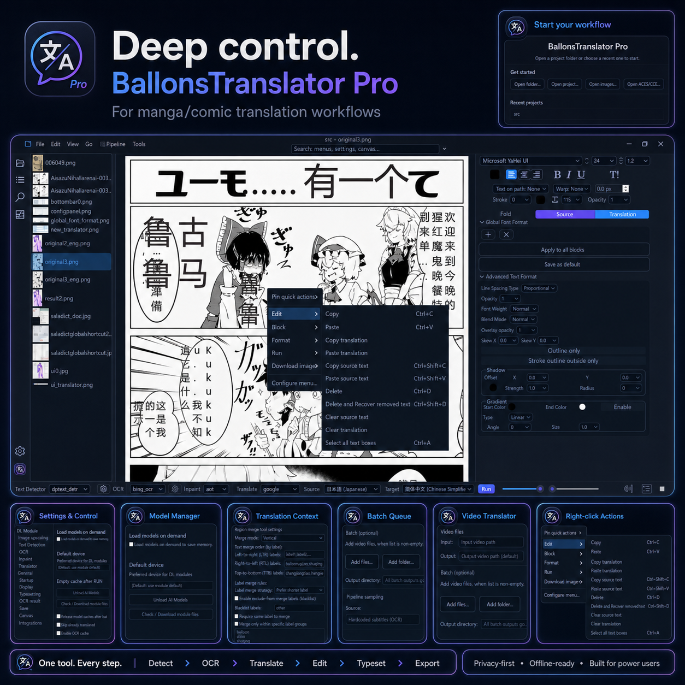

> [!IMPORTANT]
> **If you're sharing the translated result publicly and no experienced human translator participated in a thorough translation or proofread, please mark it as machine translation somewhere clear to see.**

<div align="center">

# BallonsTranslator-Pro

**AI-powered manga & comic translation toolkit — forked from [dmMaze/BallonsTranslator](https://github.com/dmMaze/BallonsTranslator) with 50+ extra modules and production-grade workflow tools.**

[简体中文](/README_zh_CN.md) | English | [pt-BR](doc/README_PT-BR.md) | [Русский](doc/README_RU.md) | [日本語](doc/README_JA.md) | [Indonesia](doc/README_ID.md) | [Tiếng Việt](doc/README_VI.md) | [한국어](doc/README_KO.md) | [Español](doc/README_ES.md) | [Français](doc/README_FR.md)

[](https://github.com/thomaswantstobeaskeleton/BallonsTranslator-Pro/stargazers)
[](https://github.com/thomaswantstobeaskeleton/BallonsTranslator-Pro/network/members)
[](LICENSE)
[](https://www.python.org/downloads/)
[](docs/GPU_ACCELERATION.md)

</div>

<p align="center">
  
</p>

## What is BallonsTranslator-Pro?

BallonsTranslator-Pro is an advanced fork of [dmMaze/BallonsTranslator](https://github.com/dmMaze/BallonsTranslator) built for **serious manga/comic scanlation workflows**. It keeps everything great from the original and adds:

- **90+ AI modules** — 20+ text detectors, 30+ OCR engines, 25+ translators, 15+ inpainters
- **Production lettering tools** — auto-layout, overflow checks, shape-aware safe areas, density-aware font scaling
- **Realtime screen translation** — always-on-top overlay for live manga reader translation
- **Translation Assist dock** — per-block TM/glossary/candidates, provider comparison, QA warnings
- **Batch queue** — multi-folder processing with pause/resume/cancel
- **Automation API** — local REST API + MCP-style command surface for headless workflows
- **Docker / server mode** — run without GUI for CI or remote workflows

---

## Quick Start

| OS | One-liner |
|---|---|
|  | Double-click `launcher.bat` or `launch_win.bat` |
|  | `python launch.py` |
|  | `python launch.py` |

```bash
# Or clone and run
git clone https://github.com/thomaswantstobeaskeleton/BallonsTranslator-Pro
cd BallonsTranslator-Pro
python launch.py
```

> GPU help (AMD RX 9070/9060/7900, NVIDIA, Apple Silicon): [docs/GPU_ACCELERATION.md](docs/GPU_ACCELERATION.md)

---

## Feature Highlights

### One-Click Translation Pipeline
<p align="center"></p>

Mix-and-match **90+ modules** across the full pipeline. No need to settle for one-size-fits-all defaults.

### Realtime Screen Translator


Always-on-top, click-through overlay. Select any screen region or follow a window. Privacy-first: nothing is persisted or logged by default.

### Translation Assist


Per-block candidate suggestions, TM/glossary lookup, side-by-side provider comparison, and block-level QA warnings.

### Production Lettering & Auto-Layout
<p align="center"></p>

Shape-aware safe areas, balanced line breaks, density-aware font scaling, and overflow safety checks.

### Batch Queue


Process multiple folders in a single queue with pause, resume, and cancel.

---

## Module Catalog

<details>
<summary><b>Text Detectors (20+)</b> — click to expand</summary>

| Module | Type | Best For |
|---|---|---|
| `ctd` (ComicTextDetector) | Built-in | Default; Japanese/English manga |
| `ysgyolo` | Pro | Filters onomatopoeia; lh5426 model |
| `animetext_yolo` | Pro | Complex anime scenes (AnimeText dataset) |
| `mangalens_bubble_segmentation` | Pro | Bubble segmentation |
| `paddle_det` / `paddle_det_v5` | Pro | Chinese/English/Japanese |
| `pp_doclayout_v3` | Pro | Complex layouts, curved pages, mixed columns |
| `easyocr_det` | Pro | Multilingual scene text |
| `craft_det` | Pro | Curved/oriented text |
| `mmocr_det` | Pro | Document/comic text (polygon) |
| `rapidocr_det` | Pro | Lightweight ONNX detection |
| `dptext_detr` | Pro | Dynamic point queries |
| `hf_object_det` | Pro | Bubble/text object detection |
| `hunyuan_ocr_det` | Pro | Full-image spotting |
| `magi_det` | Pro | Manga panels + reading order (CVPR 2024) |
| `surya_det` | Pro | 90+ languages, line-level |
| `sam_text_det` / `sam3_refiner` | Pro | SAM prompt-based segmentation |
| `swintextspotter_v2` | Pro | End-to-end text spotting |
| `textmamba_det` | Pro | Curved text (Mamba SSM) |
| `stariver_ocr` | Pro | Stariver cloud OCR |

</details>

<details>
<summary><b>OCR Engines (30+)</b> — click to expand</summary>

| Module | Type | Best For |
|---|---|---|
| `mit_32px` / `mit_48px` / `mit_48px_ctc` | Built-in | Manga-image-translator models |
| `manga_ocr` | Built-in | Japanese manga (kha-white) |
| `paddle_ocr` / `paddle_vl` | Pro | Chinese/Japanese/English |
| `easyocr_ocr` | Pro | Multilingual |
| `rapid_ocr` | Pro | Lightweight ONNX |
| `florence2_ocr` | Pro | Microsoft vision model |
| `got_ocr2` | Pro | Unified plain/scene/formatted |
| `hunyuan_ocr` | Pro | 100+ languages, spotting |
| `glm_ocr` | Pro | 0.9B document OCR |
| `internvl2_ocr` / `internvl3_ocr` | Pro | Document/chart/OCR |
| `lighton_ocr` | Pro | 1B parameter OCR |
| `chandra_ocr` | Pro | 9B document OCR (layout, tables, math) |
| `deepseek_ocr` | Pro | Heavyweight document OCR |
| `docowl2_ocr` | Pro | OCR-free document understanding |
| `bing_ocr` | Pro | Bing image OCR API |
| `google_vision` | Pro | Google Cloud Vision |
| `google_lens_exp` | Pro | Experimental Google Lens API |
| `macos_ocr` | Pro | Apple Vision (macOS native) |
| `callisto_ocr` / `qwen2vl_ocr` | Pro | VLM-based 2B OCR |
| `vlm_ocr` (generic HF) | Pro | Any HF VLM (Qwen, InternVL, OlmOCR) |
| `donut` | Pro | OCR-free document understanding |
| `llm_ocr` | Pro | LLM API OCR |
| `lens_proto` | Pro | Google Lens Protobuf |

</details>

<details>
<summary><b>Translators (25+)</b> — click to expand</summary>

| Module | Type | Best For |
|---|---|---|
| `google` | Built-in | Free, fast |
| `deepl` / `deeplx` / `deeplx_api` | Pro | High-quality NMT |
| `sugoi` | Pro | Japanese → English (offline) |
| `sakura` | Pro | Japanese → Chinese (Sakura-13B) |
| `chatgpt` / `chatgpt_exp` / `openai` | Pro | GPT-4 / GPT-3.5 |
| `gemini_neverliie` / `mistral_neverliie` | Pro | Gemini / Mistral (neverliie SDK) |
| `cohere_command_r` | Pro | Cohere Command R+ |
| `qwen_mt` | Pro | Alibaba Qwen translation |
| `hy_mt_1_5_7b` | Pro | Tencent Hunyuan MT |
| `hunyuan_mt_chimera_7b` | Pro | Ensemble refiner (multi-source → Chimera) |
| `chimera` | Pro | Multi-source ensemble |
| `ensemble` | Pro | 3 translators + LLM judge |
| `chain` | Pro | Chained translation (e.g. JP → EN → CN) |
| `mbart50` | Pro | 50-language Meta NMT |
| `nllb200` | Pro | 200-language Meta NMT |
| `opus_mt` | Pro | Helsinki NLP per-pair models |
| `t5_mt` | Pro | Prompt-based T5 translation |
| `m2m100` / `m2m100_hf` | Pro | Meta many-to-many |
| `manual` | Pro | JSON prompt workflow |
| `llm_api_translator` | Pro | Generic LLM API |
| `eztrans` | Pro | Korean game translation |
| `text-generation-webui` | Pro | Local TGW backend |
| `translatorspack` | Pro | Aggregator (google, bing, baidu, etc.) |
| `caiyun` / `baidu` / `papago` | Pro | Chinese cloud APIs |

</details>

<details>
<summary><b>Inpainters (15+)</b> — click to expand</summary>

| Module | Type | Best For |
|---|---|---|
| `aot` | Built-in | Manga-image-translator default |
| `patchmatch` | Built-in | Non-deep learning (PS-like) |
| `lama_mpe` | Built-in | Fine-tuned LaMa |
| `cuhk_manga_inpaint` | Pro | CUHK Seamless Manga (SIGGRAPH 2021) |
| `lama_onnx` / `lama_manga_onnx` | Pro | ONNX LaMa (general / manga) |
| `simple_lama` | Pro | pip-installable LaMa |
| `mat` | Pro | Mask-Aware Transformer (CVPR 2022) |
| `opencv-tela` / `opencv-classic` | Pro | OpenCV inpainting |
| `diffusers_sd_inpaint` / `diffusers_sd2_inpaint` / `diffusers_sdxl_inpaint` | Pro | Stable Diffusion family |
| `dreamshaper_inpaint` | Pro | DreamShaper 8 |
| `kandinsky_inpaint` | Pro | Kandinsky 2.1 |
| `fluently_v4_inpaint` | Pro | Anime/comic tuned |
| `repaint` | Pro | DDPM-based |
| `flux_fill` | Pro | FLUX.1 Fill (12B, high quality) |
| `qwen_image_edit` | Pro | Qwen-Image-Edit semantic fill |

</details>

---

## Pro vs Original — At a Glance

| Capability | Original | Pro |
|---|---|---|
| Text Detectors | 3 | **20+** |
| OCR Engines | 5 | **30+** |
| Translators | 10 | **25+** |
| Inpainters | 3 | **15+** |
| Realtime Screen Overlay | No | **Yes** |
| Translation Assist Dock | No | **Yes** |
| Batch Queue (multi-folder) | No | **Yes** |
| Layout Review & Auto-Layout | Basic | **Advanced** |
| Automation API / Headless | No | **Yes** |
| Docker / Server Mode | No | **Yes** |
| In-App Google Fonts Installer | No | **Yes** |
| Environment Doctor | No | **Yes** |
| Model Manager | No | **Yes** |
| PSD Export | No | **Yes** |
| InDesign LPTXT Workflow | No | **Yes** |

---

## Basic Workflow

1. **Open pages** — `File → Open Folder / Open Images`
2. **Select modules** — pick your detector + OCR + translator + inpainter
3. **Run** — one-click full pipeline
4. **Review & edit** — rich text editor with undo/redo, multi-select, style presets
5. **Export** — `Tools → Export all pages` (PNG, CBZ, PSD, InDesign LPTXT)

---

## System Requirements

- **Python** 3.10.2+ (avoid 3.10.0/3.10.1 — PyInstaller crash bug)
- **Internet** for first-time setup and model downloads
- **Disk** ~10-50 GB depending on selected models
- **GPU** optional (CUDA, ROCm, Apple Silicon, or CPU)

```bash
python --version
```

---

## Documentation

| Start Here | Quality & Lettering | Automation & Plans |
|---|---|---|
| [TROUBLESHOOTING](docs/TROUBLESHOOTING.md) | [QUALITY_RANKINGS](docs/QUALITY_RANKINGS.md) | [LOCAL_AUTOMATION_API](docs/LOCAL_AUTOMATION_API.md) |
| [GPU_ACCELERATION](docs/GPU_ACCELERATION.md) | [MODELS_REFERENCE](docs/MODELS_REFERENCE.md) | [REALTIME_TRANSLATION_MODE_PLAN](docs/REALTIME_TRANSLATION_MODE_PLAN.md) |
| [DOCS_HIGHLIGHTS](docs/DOCS_HIGHLIGHTS.md) | [TRANSLATION_CONTEXT_AND_GLOSSARY](docs/TRANSLATION_CONTEXT_AND_GLOSSARY.md) | [TRANSLATION_ASSIST_PLAN](docs/TRANSLATION_ASSIST_PLAN.md) |
| | [INDESIGN_LPTXT_WORKFLOW](docs/INDESIGN_LPTXT_WORKFLOW.md) | [FEATURE_PARITY_MATRIX](docs/FEATURE_PARITY_MATRIX.md) |

- Full change history: [docs/CHANGELOG.md](docs/CHANGELOG.md)

---

## Manga / Comic Raw Downloader

BallonsTranslator-Pro includes a registry-backed manga source downloader with built-in providers (MangaDex, Comick, GOMANGA, MangaForFree, ToonGod, Mangakakalot, NaruRaw, and more). New providers can be added via `utils/manga_sources/provider_base.py` without rebuilding the UI.

- `docs/RAW_SOURCE_PROVIDER_EXPANSION_PLAN.md` — roadmap
- `docs/MANGA_SOURCE_PLUGIN_API.md` — provider interface

```bash
python scripts/test_manga_sources.py
pytest -q tests/test_manga_provider_base.py
```

---

## License

[GPL-3.0](LICENSE) — Forked from [dmMaze/BallonsTranslator](https://github.com/dmMaze/BallonsTranslator).
