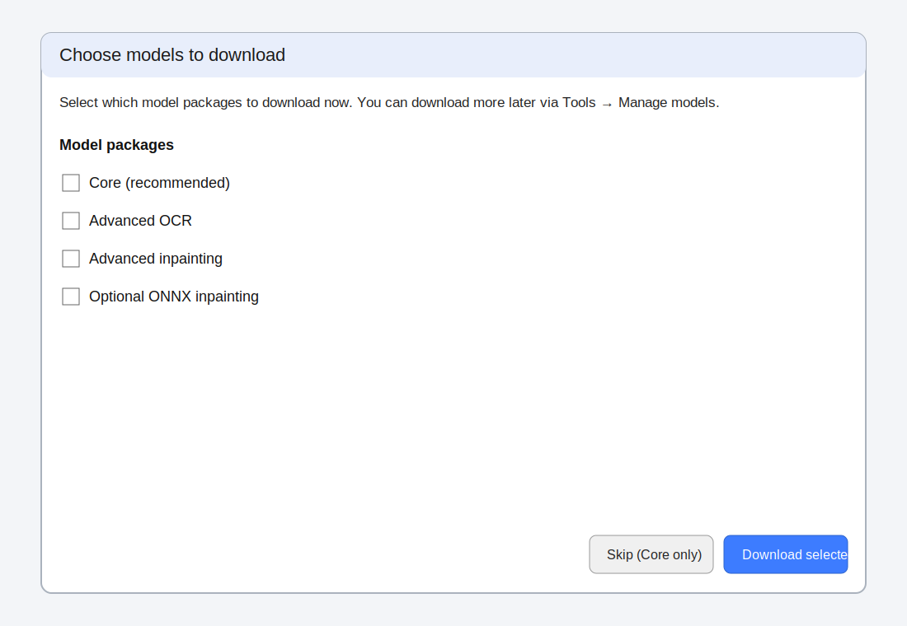
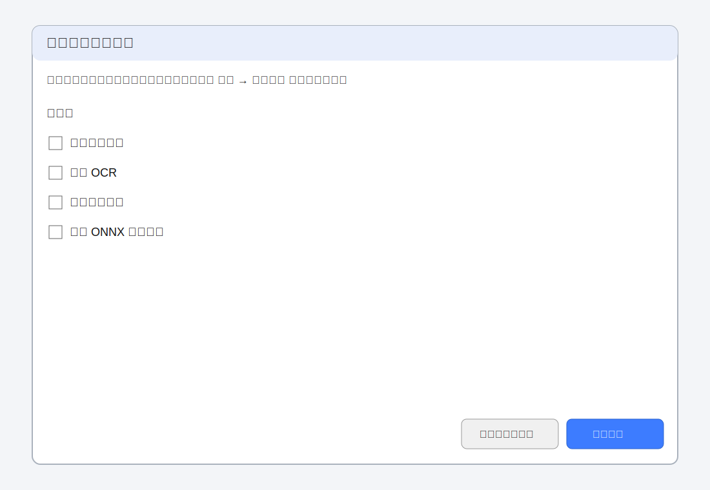

# 更新界面翻译（中文指南）

本项目使用 Qt Linguist（`.ts / .qm`）管理界面语言。显示语言可在 **配置 → 通用 → 界面语言** 或 **视图 → 界面语言** 设置。修改后通常需要重启应用以加载新语言包。

## 修复缺失或不完整翻译（以简体中文为例）

1. **编辑翻译源文件**
   - `translate/zh_CN.ts` 是简体中文翻译源。
   - 用 Qt Linguist 或文本编辑器打开。每个 `<message>` 包含 `<source>`（英文原文）与 `<translation>`（目标语言）。
   - 对缺失或错误项补齐/修正 `<translation>`。

2. **从代码提取新字符串**
   - 新增 UI 文案需通过更新脚本扫描 `ui/**/*.py` 中的 `self.tr("...")` 并合并到 `.ts`：
     - `python scripts/update_translation.py`
   - 该脚本依赖 `pylupdate6`（或 `pylupdate5`），请先安装 Qt 开发工具。
   - 更新后在 `.ts` 里补齐新条目翻译（通常为空或 `unfinished`）。

3. **将 .ts 编译为 .qm**
   - 运行时加载的是 **.qm**，不是 `.ts`。编辑完成后请编译：
     - `python scripts/compile_translation.py`
   - 或直接调用 `lrelease`：
     - `lrelease translate/zh_CN.ts`
     - `lrelease translate/zh_CN.ts -qm translate/zh_CN.qm`
   - Windows 下若找不到 `lrelease`，请安装 Qt SDK，或使用可用的 Qt 工具链。

4. **重启应用验证**
   - 将界面语言切换到简体中文（或你编辑的语言），重启后确认新 `.qm` 已生效。

## PR 提交流程建议（避免二进制报错）

- `.qm` 属于编译后的二进制产物，部分平台在 PR 审阅/创建时可能报错（如 *binary files are not supported*）。
- 建议 PR 仅提交 `.ts`（可审阅文本），`.qm` 由本地或发布流程按需编译生成。
- 本地验证建议流程：
  1. 先编译 `.qm` 并运行验证；
  2. 验证通过后还原 `.qm` 改动；
  3. 仅提交 `.ts` 与代码/文档修改。
- 若需要一键打包 `.qm`（便于分发）：
  - Linux/macOS：`scripts/package_qm_bundle.sh`
  - Windows：`scripts/package_qm_bundle.bat`

## 切换中文时的 QFont 警告

若日志出现 `QFont::setPointSize: Point size <= 0 (-1)`，请确认已使用包含字体尺寸修正的版本（`launch.py` 与 `utils/widget.py` 已做兜底）。

## 涉及文件

| 文件 | 作用 |
|---|---|
| `translate/zh_CN.ts` | 简体中文翻译源（主要编辑对象） |
| `translate/zh_CN.qm` | 运行时加载的编译语言包（由本地脚本生成，不再提交到 Git） |
| `scripts/update_translation.py` | 扫描 UI 并更新 `.ts` 源文案 |
| `utils/shared.py` | `DISPLAY_LANGUAGE_MAP`、`DEFAULT_DISPLAY_LANG` |
| `launch.py` | 按配置加载翻译器与 `.qm` |

## 首次启动 / 模型管理文案本地化流程

当你修改首次启动模型包 UI（例如 `ui/model_package_selector_dialog.py`、`ui/model_manager_dialog.py`，或 `ui/mainwindow.py` / `ui/mainwindowbars.py` 相关入口）时：

1. 在代码中使用 `self.tr(...)` 包裹用户可见文案。
2. 对 `utils/model_packages.py` 中的模型包目录字符串，使用 `QT_TRANSLATE_NOOP("ModelPackageCatalog", ...)` 进行注册，确保提取工具可识别。
3. 同步以下资源：
   - `translate/startup_model_ui.en_US.json`
   - `translate/startup_model_ui.zh_CN.json`
4. 确认相同文本已进入 `translate/zh_CN.ts`（包含 source 与中文 translation）。
5. 执行检查：
   - `python scripts/check_startup_model_ui_i18n.py`

## 首次模型包选择器示意图

英文：

中文（简体）：

